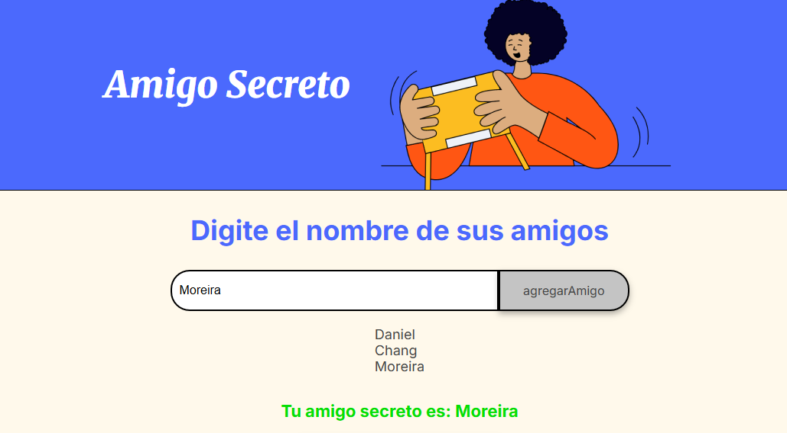

# Challenge de Amigo Secreto

Mi actividad de ONE sobre el challenge de amigo secreto

##Características del Proyecto
* **Validación de entradas:** El sistema valida que el campo de texto no esté vacío antes de agregar un nombre de forma dinámica.
* **Manipulación del DOM:** Los nombres de los participantes se renderizan automáticamente en una lista visible en la pantalla.
* **Algoritmo de sorteo:** Implementación de funciones de JavaScript para seleccionar de forma aleatoria un elemento del arreglo, asegurando un resultado óptimo.

##Tecnologías Utilizadas
* **HTML5:** Estructuración semántica de la página web.
* **CSS3:** Diseño visual, estilos personalizados y maquetación adaptativa.
* **JavaScript (ES6):** Lógica del negocio, manejo de arreglos y dinamismo de la aplicación.
* **Git & GitHub:** Control de versiones y despliegue continuo.
